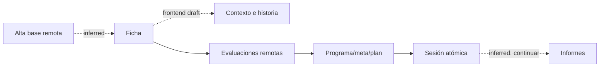

# Especificación de flujos

## Journey J-01: alta inicial de cliente

| Paso | Desde | Acción | Hacia/estado | Evidencia | Criterio de aceptación |
|---|---|---|---|---|---|
| 1 | Gestión de clientes | Seleccionar Añadir nuevo cliente | Alta de cliente | E-002 | Se muestran los campos básicos observados. |
| 2 | Alta de cliente | Añadir tutor | Bloque de tutor adicional | E-003 | Aparece un bloque independiente sin perder los anteriores. |
| 3 | Alta de cliente | Añadir hermano | Bloque de hermano adicional | E-003 | Aparece un bloque con fecha y edad calculada. |
| 4 | Alta de cliente | Introducir nacimiento | Edad calculada | E-002, E-003 | La edad muestra años/meses usando reloj controlado. |
| 5 | Alta de cliente | Guardar | Detalle de cliente | transición no capturada | No implementar persistencia hasta aprobar reglas y estado final. |

## Journey J-02: configurar intervención y registrar sesión

| Paso | Desde | Acción | Hacia/estado | Evidencia | Criterio de aceptación futuro |
|---|---|---|---|---|---|
| 1 | Detalle | Abrir Programas de Adquisición | Lista/formulario | E-013, E-014 | Mostrar programa y metas según evidencia. |
| 2 | Detalle | Abrir Reducción de Conductas | Lista/formulario | E-015, E-016 | Separar conductas y funciones. |
| 3 | Detalle | Iniciar Sesión | Registro de sesión | E-017, E-018 | Cargar metas/conductas activas. |
| 4 | Sesión | Correcto/Incorrecto o +/- | Medición actualizada | E-017, E-018 | Actualizar la dimensión correspondiente. |
| 5 | Sesión | Finalizar | Gráficos/historial | no capturada | Requiere especificación y aprobación. |

## Journey J-03: informes

| Paso | Desde | Acción | Resultado | Evidencia | Criterio futuro |
|---|---|---|---|---|---|
| 1 | Detalle | Descargar info completa | Informe consolidado | E-020 | Exportar sólo datos autorizados. |
| 2 | Reducción | Descargar programas + conductas | Documento | E-016 | Formato por confirmar. |
| 3 | Gráficos | JPG | Imagen de gráfico | E-019 | La exportación representa el gráfico visible. |

## Overlay de verificación en staging (2026-08-24)

La tabla siguiente no reclasifica como observadas las transiciones que el video no capturó. Registra
qué camino propuesto fue comprobado con datos sintéticos autenticados y qué no debe considerarse
cierre de producto.

### Journey V-01: núcleo clínico persistente

| Paso | Desde | Acción | Hacia / estado | Evidencia | Criterio de aceptación |
| --- | --- | --- | --- | --- | --- |
| 1 | `/clientes` | Alta de adulto ficticio | `/clientes/:id` | E2E-2026-08-24 | Ficha, convivencia y tutor vuelven a cargar bajo RLS. |
| 2 | Detalle | Guardar tres evaluaciones sintéticas | Conteo por evaluación | E2E-2026-08-24 | Cada tipo aparece tras refrescar sin mezclar cliente. |
| 3 | Detalle | Crear programa, meta y plan | Configuración de sesión | E2E-2026-08-24 | Meta pertenece al programa y ambas áreas están disponibles para sesión. |
| 4 | Sesión | Guardar medición y ensayos | Sesión confirmada | E2E-2026-08-24 | RPC atómica crea cabecera e hijos o no crea ninguno. |
| 5 | `/informes` | Seleccionar el mismo cliente | Serie y porcentaje | E2E-2026-08-24 | Serie = 3; 8/(8+2) = 80.0%. |

```mermaid
flowchart LR
  C[Clientes] -->|alta sintética verificada| D[Detalle]
  D -->|evaluaciones verificadas| A[Configuración clínica]
  A -->|programa, meta y plan verificados| S[Sesión atómica]
  S -->|serie y porcentaje verificados| R[Informe derivado]
  R -. "pendiente: exportación S-08/S-13" .-> X[Archivo autorizado]
```

### Estados pendientes priorizados

| Estado | Clasificación | Test requerido antes de cerrar |
| --- | --- | --- |
| Escritura 201 seguida de falso error visual | defecto P0 confirmado | Crear cada entidad, confirmar estado de éxito y conteo sin F5. |
| Refresco posterior a escritura falla | propuesto de resiliencia | Comunicar guardado confirmado y ofrecer reintento de refresco sin duplicar. |
| Exportación de evaluación/completa/JPG | no implementado | Aprobar contenido/autorización y comprobar descarga mínima. |
| Corrección de sesión | no especificado | Aprobar regla clínica, auditoría y comportamiento de historial. |

## Journey J-04: cierre frontend de formularios clínicos (Slice 14)

| Paso | Desde | Acción | Hacia / estado | Evidencia | Criterio de aceptación |
| --- | --- | --- | --- | --- | --- |
| 1 | `/clientes/nuevo` | crea perfil base sintético | `/clientes/:id` | E-002–E-006; transición inferred | la ficha mantiene clientId y ofrece siguiente módulo |
| 2 | ficha | prepara contexto/historia | draft temporal | E-004–E-006; persistencia inferred | visible como no guardado y sólo memoria |
| 3 | ficha | cambia pestaña y vuelve | draft temporal restaurado | proposed | no pierde datos durante la sesión React |
| 4 | evaluación | completa entrevista/preferencia/funcional | guardado o error | E-009–E-011 | payload tipado, archivo excluido, error conserva valores |
| 5 | adquisición | crea programa y meta | objetivos disponibles | E-013–E-014 | relación programa→meta intacta |
| 6 | reducción | crea plan | conducta disponible | E-015–E-016 | unidad y estrategias coinciden con resumen |
| 7 | sesión | registra datos | confirmación atómica | E-017–E-018 | cuatro dimensiones usan contrato correcto |
| 8 | ficha/sesión | selecciona Continuar | módulo/ruta siguiente | inferred | conserva cliente y no marca aprobación clínica |
| 9 | cualquier draft temporal | recarga | vacío + advertencia | proposed | no existe persistencia oculta |

### Gates J-04

- `frontend-draft` nunca muestra guardado remoto.
- RUT/correo se rechazan en texto libre; archivos no se leen ni suben.
- Un remount borra contexto/historia y una prueba comprueba ausencia de storage/red.
- Consentimiento/acceso no tiene acción de escritura.
- Mezcla entre dos clientes es P0.
