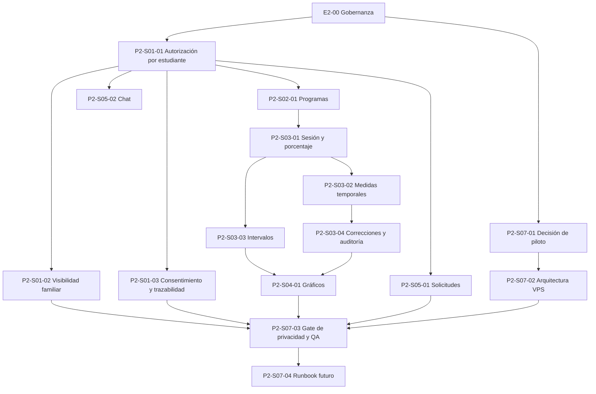

# PM — Épica de Fase 2: preparación verificable para piloto público controlado

Fecha: 2026-08-30  
Estado: **propuesta de organización; no autoriza programación, cambios de esquema, infraestructura, despliegue ni publicación**

## Propósito

Organizar la segunda fase de ABA Data Hub a partir del estado local de Fase 1 y de la visión APP ABA. El resultado esperado es un backlog trazable de historias que equivalen a specs atómicas, con tareas pequeñas, decisiones previas, dependencias y criterios para comenzar cada una de forma segura.

La fase prepara dos cosas en paralelo pero con gates independientes:

1. La definición funcional y clínica de las brechas priorizadas del producto.
2. La definición verificable de una futura VPS y de una publicación para un piloto público controlado.

No supone que un build local verde, el candidato local del Slice 15 ni esta planificación autoricen acceso público o tratamiento de datos clínicos reales.

## Fuente y trazabilidad

| Fuente | Uso en esta épica | Clasificación |
| --- | --- | --- |
| `docs/system-rebuild/current-development-state.md` | snapshot de Fase 1, límites y preparación de publicación | Verificado documentalmente |
| `docs/system-rebuild/comparativo-spec.md` | cobertura existente y brechas APP ABA | Verificado en código/documentación local según el comparativo |
| `docs/system-rebuild/atomic-model-aba-contract.md` | visión de negocio, decisiones DEC-ABA y backlog S-ABA | Observado en la fuente de visión y propuesto para spec |
| `docs/system-rebuild/handoffs/2026-08-29-brujula-slice-15-local-candidate.md` | evidencia y límites del candidato local Slice 15 | Verificado localmente |
| `docs/system-rebuild/decision-log/spec-reorganization-log.md` | cadencia de reorganización de specs | Verificado documentalmente |

**Convención:** *verificado* significa que existe evidencia local citada; *inferido* es una agrupación o secuencia de PM basada en esas fuentes; *pendiente* exige una decisión explícita antes de convertirse en spec aprobada o trabajo técnico.

## Objetivo de Fase 2

Al cierre de esta fase de preparación, el proyecto deberá contar con una épica priorizada, historias/specs de cuatro capas listas para aprobación individual, un mapa de dependencias, un registro de decisiones bloqueantes y un plan de readiness para un piloto público restringido. La Fase 2 de preparación no produce código ni infraestructura.

## Resultados esperados

- [ ] Backlog priorizado de historias equivalentes a specs atómicas, con una fuente y estado de decisión claros.
- [ ] Una definición aprobable de permisos por estudiante y visibilidad familiar antes de extender UI, RLS o datos clínicos.
- [ ] Specs separadas para expediente, programas, sesiones, medidas, gráficos, colaboración, salidas y offline cuando corresponda.
- [ ] Criterios de entrada (Ready) y salida (Done documental) uniformes para cada spec.
- [ ] Ruta de preparación de VPS/publicación con un gate explícito antes de adquirir, crear o configurar infraestructura.
- [ ] Plan de QA público que complete los vacíos del candidato local: navegador real, RLS autenticada y PDF físico/visual, cuando se autorice.
- [ ] Handoff y Brújula actualizados sólo después de cada checkpoint autorizado.

## No objetivos

- No implementar funcionalidades, editar código, dependencias, schema, RLS, Auth, Storage ni datos.
- No crear una VPS, cuenta de proveedor, dominio, DNS, secretos, buckets, repositorio remoto, pipeline, despliegue ni URL pública.
- No cargar, migrar ni usar datos reales, identificatorios, clínicos o de menores.
- No prometer arquitectura de microservicios, IA, offline o exportaciones sin una decisión y spec independientes.
- No reinterpretar una brecha parcial como funcionalidad equivalente a APP ABA.

## Estado de partida

| Área | Estado de partida | Tipo |
| --- | --- | --- |
| Base React/TypeScript, rutas protegidas y shadcn/ui | existe localmente | Verificado |
| Roles y RLS organizacionales base | admin, clinician y viewer; no por estudiante/recurso | Verificado; brecha identificada |
| Expediente, evaluaciones, programas y sesión atómica | núcleo local existente | Verificado; cobertura parcial frente a APP ABA |
| Informes y PDF | contrato local verde; smoke visual/autenticado y PDF físico pendientes | Verificado localmente; QA pendiente |
| VPS, dominio, URL y pruebas públicas | no existe publicación autorizada en el snapshot de Fase 1 | Verificado documentalmente |

## Épicas de trabajo

### E2-00 — Gobernanza, trazabilidad y gates de Fase 2

**Resultado:** un marco de trabajo que impide iniciar cambios sin decisiones, una spec de cuatro capas y evidencia proporcional.

| Historia = spec | Estado | Tareas simples |
| --- | --- | --- |
| P2-S00-01 — Mapa de alcance y fuentes | Inferida; lista para preparación | 1. Registrar las fuentes autorizadas y su fecha. 2. Clasificar cada requisito como observado, verificado, inferido o pendiente. 3. Enlazar cada brecha del comparativo a una historia P2. 4. Identificar qué specs existentes siguen vigentes y cuáles sólo son evidencia histórica. 5. Presentar el mapa para aprobación sin editar specs vigentes. |
| P2-S00-02 — Plantilla de spec atómica y Definition of Ready | Inferida; lista para preparación | 1. Definir las cuatro capas: frontend, backend, Supabase y publicación. 2. Añadir BDD, fixtures anonimizados, riesgos y stop conditions. 3. Añadir sección de decisiones y evidencia fuente. 4. Definir revisión clínica/privacidad cuando aplique. 5. Validar que la plantilla no autoriza implementación. |
| P2-S00-03 — Plan de checkpoints y continuidad | Inferida; depende de P2-S00-02 | 1. Establecer un checkpoint tras cada spec aprobada y otro tras cinco materializaciones, conforme al registro de reorganización. 2. Definir evidencia mínima para handoff. 3. Definir cuándo actualizar Brújula. 4. Registrar conflictos de evidencia sin sobrescribir historia. 5. Solicitar aprobación del ritmo de revisión. |

### E2-01 — Identidad, autorización por estudiante y privacidad familiar

**Resultado:** decisiones y specs que traduzcan los roles ABA a acciones verificables por estudiante y recurso. Es el bloqueante principal de toda capacidad clínica y colaborativa nueva.

| Historia = spec | Estado | Tareas simples |
| --- | --- | --- |
| P2-S01-01 / S-ABA-01 — Matriz de autorización por estudiante | Pendiente DEC-ABA-01 | 1. Inventariar recursos: expediente, programa, sesión, registro, gráfico, salida y chat. 2. Inventariar acciones: ver, crear, editar, registrar, enviar, descargar, autorizar y revocar. 3. Proponer matriz para supervisor principal, coordinador/secundario, terapeuta y familia. 4. Definir alcance, inicio, vencimiento si aplica, denegación y revocación. 5. Escribir reglas de UI, backend, Supabase/RLS y publicación. 6. Redactar escenarios BDD con identidades sintéticas. |
| P2-S01-02 / parte de S-ABA-02 — Visibilidad familiar y datos mínimos | Pendiente DEC-ABA-02 y DEC-ABA-03 | 1. Listar los resultados que podría ver una familia y los campos prohibidos. 2. Definir aprobación, periodicidad y estados vacíos. 3. Clasificar campos del expediente como obligatorio, opcional o fuera de MVP. 4. Mapear permiso de lectura/edición por campo y rol. 5. Definir estados sin autorización y errores sin revelar información. 6. Redactar BDD de separación de visibilidad. |
| P2-S01-03 / S-ABA-02 — Consentimiento y trazabilidad clínica | Pendiente DEC-ABA-03 y DEC-ABA-05 | 1. Decidir si el consentimiento es referencia, archivo o firma externa. 2. Definir quién puede crear, consultar y cambiar su estado. 3. Definir vigencia, auditoría y retención a nivel de producto, sin implementar. 4. Delimitar el historial de medicación para evitar sobrescritura implícita. 5. Identificar impacto en privacidad, infraestructura y QA. 6. Someter la spec a aprobación separada. |

### E2-02 — Programas ABA y ciclo de vida clínico

**Resultado:** modelo funcional completo y versionable de programas de adquisición y conducta, antes de ampliar la captura de datos.

| Historia = spec | Estado | Tareas simples |
| --- | --- | --- |
| P2-S02-01 / S-ABA-03 — Diseño y ciclo de vida de programas | Pendiente | 1. Definir identificador, estudiante propietario y tipo de programa. 2. Listar campos de adquisición y conducta, con obligatoriedad y validación. 3. Definir estados activo, logrado, pausado y discontinuado, y transiciones permitidas. 4. Decidir versión frente a edición directa y su auditoría. 5. Definir listados, filtros, estados vacíos y acciones por rol. 6. Escribir BDD de crear, pausar, reactivar y consultar con fixtures sintéticos. |
| P2-S02-02 / parte de S-ABA-09 — Salida de programa | Pendiente DEC-ABA-09 | 1. Separar exportación de programa de informes y gráficos. 2. Definir formato, contenido, permiso y acción manual. 3. Definir datos excluidos por privacidad. 4. Definir errores y ausencia de contenido. 5. Establecer QA de formato sin producir archivos todavía. 6. Esperar decisión de salida antes de cualquier contrato técnico. |

### E2-03 — Sesión guiada y plantillas de medición ABA

**Resultado:** especificaciones de captura en tiempo real separadas por familia de medida. La sesión atómica existente no se asume equivalente a este flujo.

| Historia = spec | Estado | Tareas simples |
| --- | --- | --- |
| P2-S03-01 / S-ABA-04 — Sesión y porcentaje por ensayos | Pendiente DEC-ABA-06 | 1. Definir apertura, guardado, envío, finalización, abandono y reanudación. 2. Definir sets, ítems, fase y el rango de ensayos. 3. Definir códigos y ayudas permitidas. 4. Definir registros incompletos y cambio de programa durante sesión. 5. Definir fórmula de porcentaje y payload al gráfico. 6. Escribir BDD de captura y reingreso con fixtures sintéticos. |
| P2-S03-02 / S-ABA-05 — Frecuencia, duración, latencia y TER | Pendiente DEC-ABA-04 y DEC-ABA-06 | 1. Definir unidad y fórmula de cada medida. 2. Definir contador, cronómetro, inicio, fin, pausa y tiempos parciales. 3. Delimitar cancelación, faltantes y valores inválidos. 4. Definir datos derivados para cada gráfico. 5. Precisar qué roles pueden capturar, corregir o enviar. 6. Redactar ejemplos deterministas y BDD. |
| P2-S03-03 / S-ABA-06 — Intervalo total, parcial y momentáneo | Pendiente DEC-ABA-04 | 1. Diferenciar las tres modalidades sin usar un campo ambiguo. 2. Definir observación, cantidad/duración y punto de muestreo. 3. Definir ocurrencia/no ocurrencia y fórmula de resultado. 4. Definir datos incompletos y configuración inválida. 5. Definir gráfico, escala y leyenda por modalidad. 6. Redactar BDD y ejemplos sintéticos. |
| P2-S03-04 — Edición, corrección y auditoría de registros | Pendiente DEC-ABA-05 | 1. Decidir inmutabilidad, corrección, anulación y reenvío. 2. Definir qué se audita, quién lo consulta y por cuánto tiempo. 3. Definir efecto sobre puntos y gráficos derivados. 4. Definir mensaje al usuario y protección contra cambios accidentales. 5. Identificar impacto por capa. 6. Preparar criterios de seguridad y BDD. |

### E2-04 — Gráficos y salidas clínicas

**Resultado:** contrato de gráficos que distinga datos fuente, cálculos, edición, visibilidad y salidas.

| Historia = spec | Estado | Tareas simples |
| --- | --- | --- |
| P2-S04-01 / S-ABA-07 — Gráficos por programa | Pendiente DEC-ABA-04 y DEC-ABA-05 | 1. Establecer la fuente canónica de cada punto. 2. Definir ejes, rangos, fechas/número de sesión, fases y leyendas. 3. Definir filtros de respuesta y actual/histórico. 4. Definir estados sin datos, datos incompletos y permisos. 5. Delimitar edición clínica y auditoría. 6. Alinear el contrato con el PDF de informes existente sin ampliar su alcance. |
| P2-S04-02 / parte de S-ABA-09 — Exportación de gráficos e informes | Pendiente DEC-ABA-09 | 1. Separar gráfico individual, informe completo y programa en contratos distintos. 2. Definir formato, contenido, permisos y trazabilidad. 3. Definir descarga frente a compartición; no asumir persistencia. 4. Registrar controles de privacidad por tipo de salida. 5. Definir pruebas de payload, accesibilidad y formato. 6. Identificar cualquier requisito de infraestructura futura. |
| P2-S04-03 / parte de S-ABA-09 — Mapa de flujo del procedimiento | Pendiente DEC-ABA-07 | 1. Definir si el mapa es manual, asistido o generado por IA. 2. Definir revisión humana obligatoria y responsabilidad clínica. 3. Definir datos permitidos, proveedor, retención y privacidad si hay IA. 4. Definir formato, descarga y errores. 5. Evaluar alternativa sin IA antes de decidir. 6. No crear integración hasta aprobación de la decisión. |

### E2-05 — Colaboración clínica

**Resultado:** límites explícitos para solicitudes de edición y chat asociados a un estudiante, sin introducir una nueva superficie de privacidad sin contrato.

| Historia = spec | Estado | Tareas simples |
| --- | --- | --- |
| P2-S05-01 / parte de S-ABA-08 — Solicitudes de autorización | Pendiente DEC-ABA-01 y DEC-ABA-10 | 1. Definir solicitante, aprobador y recursos afectados. 2. Definir estados: borrador, enviada, aprobada, denegada, vencida si corresponde y revocada. 3. Definir notificaciones y trazabilidad de decisión. 4. Definir errores, recordatorios y estados vacíos. 5. Alinear cada transición con la matriz de autorización. 6. Escribir BDD sintético de solicitud y decisión. |
| P2-S05-02 / parte de S-ABA-08 — Chat por estudiante | Pendiente DEC-ABA-10 | 1. Definir participantes, conversación de equipo y mensajes directos. 2. Delimitar si la familia participa; no asumirlo. 3. Definir contenido permitido, visibilidad, retención y moderación. 4. Definir permisos, búsqueda, estados vacíos y errores. 5. Registrar riesgos de datos clínicos y de publicación pública. 6. Esperar aprobación antes de elegir persistencia o proveedor. |

### E2-06 — Resiliencia y sincronización offline

**Resultado:** decisión de producto y plan de seguridad para offline; no es parte implícita de la sesión en vivo.

| Historia = spec | Estado | Tareas simples |
| --- | --- | --- |
| P2-S06-01 / S-ABA-10 — Alcance offline y sincronización | Pendiente DEC-ABA-08 | 1. Confirmar si offline forma parte del piloto o de una fase posterior. 2. Delimitar datos, dispositivos y acciones cubiertos. 3. Definir cifrado, acceso local y recuperación ante pérdida. 4. Definir cola, reintentos, conflictos e indicadores de estado. 5. Definir una sesión abierta sin conexión. 6. Revisar impacto en frontend, backend, Supabase, publicación y privacidad. |

### E2-07 — Preparación de VPS y publicación para piloto público controlado

**Resultado:** una spec de publicación preparada para aprobación futura. Esta épica **no autoriza** crear infraestructura, contratar servicios, almacenar secretos, desplegar ni publicar.

| Historia = spec | Estado | Tareas simples |
| --- | --- | --- |
| P2-S07-01 — Decisión de piloto y alcance de audiencia | Pendiente | 1. Definir qué significa “prueba pública”: piloto invitado, beta restringida, lista de espera o acceso abierto. 2. Definir titular, presupuesto, país/región y audiencia permitida. 3. Definir si el piloto usa sólo datos sintéticos o qué aprobación legal/documental sería necesaria para datos reales. 4. Definir soporte, canal de incidentes y criterio de suspensión. 5. Documentar riesgos de salud/menores y responsables de decisión. 6. Obtener aprobación explícita antes de la spec de infraestructura. |
| P2-S07-02 — Arquitectura objetivo de VPS y controles operativos | Pendiente P2-S07-01 | 1. Comparar opciones de proveedor/VPS sin abrir cuentas ni comprar servicios. 2. Proponer separación de ambientes y límite de responsabilidades. 3. Definir dominio/subdominio, DNS, TLS y correo transaccional como decisiones, no acciones. 4. Definir inventario de secretos, rotación y acceso mínimo. 5. Definir backups, restauración, logs, monitoreo, alertas y retención. 6. Definir reversión, mantenimiento y responsable operativo. |
| P2-S07-03 — Gate de seguridad, privacidad y QA previo a publicar | Pendiente P2-S07-01 y P2-S07-02 | 1. Completar matriz de permisos por estudiante y visibilidad familiar aprobadas. 2. Definir revisión de amenazas, privacidad, retención, consentimiento y exportaciones. 3. Definir pruebas autorizadas en navegador real, RLS autenticada y PDF físico/visual. 4. Definir pruebas de registro, recuperación de fallos, respaldo y reversión. 5. Definir criterios de go/no-go y el responsable de aprobarlos. 6. Registrar que un build verde no sustituye estos gates. |
| P2-S07-04 — Runbook de publicación y piloto | Pendiente P2-S07-03 | 1. Escribir una secuencia reversible de preparación, verificación y activación para futura aprobación. 2. Identificar las credenciales, datos y servicios que requerirían autorización separada. 3. Definir checklist de comunicación de piloto y soporte. 4. Definir observabilidad e indicadores del piloto. 5. Definir criterio de pausa y plan de reversión sin borrado. 6. Mantenerlo como documento; no ejecutar pasos de infraestructura. |

## Dependencias y orden recomendado

**Orden inferido de PM:** primero E2-00 y las decisiones de E2-01; después programas y sesión; luego medidas, gráficos y colaboración. La preparación VPS puede documentarse desde P2-S07-01, pero ningún gate de publicación puede cerrarse antes de permisos, privacidad y QA autorizada.

## Decisiones bloqueantes

| ID | Decisión | Bloquea | Estado |
| --- | --- | --- | --- |
| DEC-ABA-01 | matriz, alcance y revocación de permisos | E2-01, E2-03, E2-04, E2-05 y gate público | Pendiente |
| DEC-ABA-02 | resultados visibles para familia | E2-01 y gate público | Pendiente |
| DEC-ABA-03 | ciclo de consentimiento | E2-01 y gate público | Pendiente |
| DEC-ABA-04 | fórmulas y reglas de medidas/gráficos | E2-03 y E2-04 | Pendiente |
| DEC-ABA-05 | edición y auditoría de registros | E2-03 y E2-04 | Pendiente |
| DEC-ABA-06 | sesión, concurrencia, reanudación y envío | E2-03 | Pendiente |
| DEC-ABA-07 | mapa de flujo/IA, privacidad y revisión humana | P2-S04-03 | Pendiente |
| DEC-ABA-08 | offline y sincronización | E2-06 | Pendiente |
| DEC-ABA-09 | exportaciones e informes futuros | P2-S02-02 y E2-04 | Pendiente |
| DEC-ABA-10 | chat, retención y moderación | E2-05 | Pendiente |
| DEC-PUB-01 | tipo de piloto, proveedor, región, presupuesto y titularidad | toda acción futura de VPS/publicación | Pendiente |
| DEC-PUB-02 | datos permitidos, privacidad, soporte y criterios de suspensión del piloto | gate público y runbook | Pendiente |

## Criterios de Ready

Una historia/spec puede pasar de backlog a preparación detallada sólo si:

- [ ] Tiene un único resultado de negocio, usuario/rol y límite explícito.
- [ ] Está trazada al contrato atómico y al comparativo; cualquier parte inferida está marcada.
- [ ] Todas sus decisiones bloqueantes están aprobadas o quedan explícitamente fuera de alcance.
- [ ] Tiene las cuatro capas: frontend, backend, Supabase y publicación, incluso si una capa declara “sin cambio”.
- [ ] Define permisos por rol, estudiante y acción cuando maneja información clínica.
- [ ] Define estados, transiciones, validaciones, errores, estados vacíos y auditoría si corresponde.
- [ ] Contiene escenarios BDD y fixtures sólo anonimizados/sintéticos.
- [ ] Identifica riesgos de privacidad, datos de menores, exportación, IA u offline cuando aplique.
- [ ] Incluye criterios de QA y stop conditions sin presupuestar ejecución no autorizada.
- [ ] Cuenta con aprobación explícita de la persona usuaria antes de programar.

## Criterios de Done documental

Una historia/spec de esta fase de organización estará cerrada documentalmente cuando:

- [ ] La spec de cuatro capas y BDD hayan sido revisados y aprobados explícitamente.
- [ ] Las decisiones asociadas estén registradas con alcance y consecuencias.
- [ ] Las dependencias y riesgos estén actualizados.
- [ ] La historia siguiente haya sido reevaluada frente a esa decisión.
- [ ] Se haya emitido un handoff y actualizado la Brújula en el checkpoint correspondiente.

Esto no equivale a “implementado”, “desplegado” ni “listo para uso público”.

## Criterios adicionales para Ready de infraestructura y publicación

Ningún trabajo de VPS/publicación pasa de planificación a ejecución hasta que se cumplan todos:

- [ ] Aprobación explícita de proveedor, región, titularidad, presupuesto y tipo de audiencia.
- [ ] Aprobación de dominio/DNS/TLS/correo y de los responsables operativos.
- [ ] Separación de ambiente, inventario de secretos, acceso mínimo, rotación y backups definidos.
- [ ] Políticas de datos permitidos, consentimiento, retención, soporte, incidentes y reversión aprobadas.
- [ ] Matriz de autorización por estudiante y visibilidad familiar aprobadas y verificadas según una spec posterior.
- [ ] Gate de QA autorizado: navegador real, RLS autenticada, PDF físico/visual, recuperación y pruebas de seguridad pertinentes.
- [ ] Go/no-go y responsable de aprobación documentados.

## Próximo paso propuesto

Presentar esta épica para aprobación y, si se aprueba, iniciar exclusivamente P2-S00-01 y P2-S00-02 como trabajo documental. La primera spec funcional a preparar sería P2-S01-01 / S-ABA-01, porque su decisión de permisos bloquea el resto del backlog y cualquier piloto público.

## Stop conditions

Detener y solicitar autorización explícita antes de programar, modificar Supabase/Auth/RLS/Storage, crear servicios, contratar o crear VPS, registrar un dominio, configurar secretos, usar cuentas de terceros, desplegar, publicar, ejecutar pruebas con datos reales o ampliar el acceso familiar.
