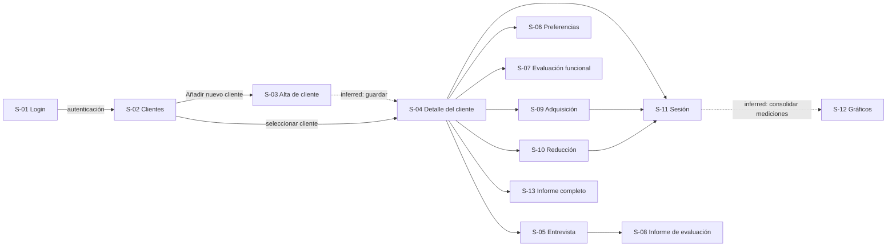
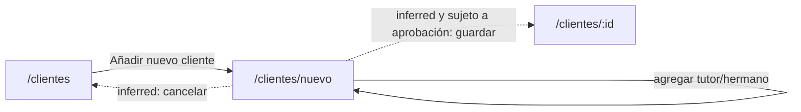
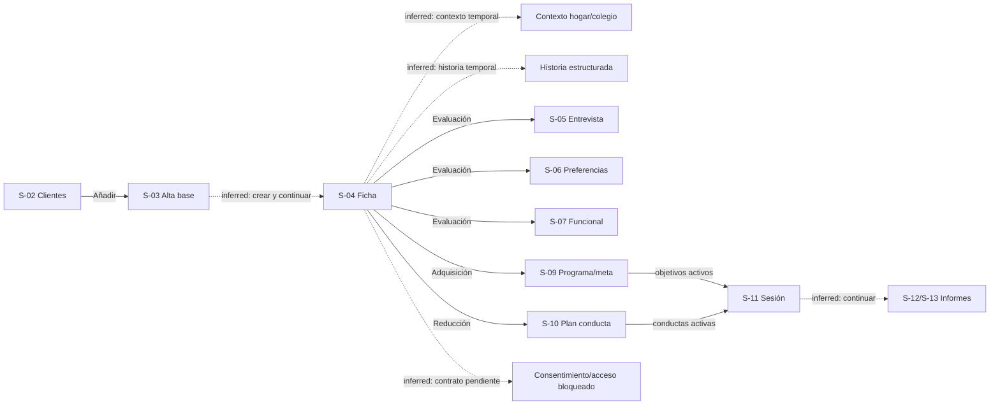

# Mapa de flujos de pantalla

Las líneas sólidas representan navegación observada en el video. Las líneas punteadas representan transiciones propuestas que deben aprobarse.

## Flujo principal

## Flujo del primer slice

## Estados

| Estado | Pantalla | Evidencia | Clasificación |
|---|---|---|---|
| Sin clientes / métricas en cero | S-02 | E-002 | observed |
| Modal de alta largo con scroll | S-03 | E-002–E-006 | observed |
| Cliente activo | S-04, S-10 | E-007, E-016 | observed |
| Cargando conductas | S-10 | E-015 | observed |
| Programa sin conductas configuradas | S-10 | E-015 | observed |
| Validación de formulario | S-03 | no capturada | proposed |
| Guardando / error / éxito | S-03 | no capturada | proposed |
| Sesión pausada/finalizada | S-11 | no capturada | proposed |

## Estado de implementación y cierre

El núcleo `Clientes → Detalle → Evaluaciones/Configuración → Sesión → Informes` fue ejecutado en
staging con datos sintéticos el 2026-08-24. Es una verificación de la implementación, no evidencia
visual adicional del producto de origen: las flechas punteadas del diagrama principal conservan su
clasificación `inferred` cuando el video no mostró la transición.

| Grupo de pantallas | Estado de implementación | Próxima spec |
| --- | --- | --- |
| S-01–S-04 | rutas y flujo base disponibles; E2E de alta/ficha comprobado | `slice-10/frontend.md` 10A y 10D |
| S-05–S-07 | formularios conectados, cobertura de campos parcial | `slice-10/frontend.md` 10A y 10B |
| S-09–S-11 | programa, meta, plan y sesión atómica conectados; cobertura de protocolo parcial | `slice-10/frontend.md` 10A y 10B |
| S-12 | informe derivado, gráficos e impresión local disponibles | `slice-12/frontend.md` |
| S-08 | ruta de evaluación visible, pero todavía no consolida registros de evaluación | `slice-13/frontend.md` |
| S-13 | informe completo minimizado y PDF local bajo demanda; paridad completa pendiente | `slice-12/frontend.md`, `slice-13/frontend.md` |

El detalle verificable y los criterios de aceptación actuales están en
`docs/system-rebuild/flow-spec.md` (Journey V-01) y `specs/slice-10/`.

## Overlay Slice 14 — cierre de formularios clínicos

Contexto e historia son borradores de memoria en Slice 14: las flechas no implican persistencia. La
brújula `Continuar` es propuesta y conserva esa clasificación aunque se implemente.

### Estados Slice 14

| Estado | Módulo | Evidencia | Clasificación |
| --- | --- | --- | --- |
| formulario modal largo | S-03, S-05–S-07, S-09–S-10 | E-002–E-016 | observed |
| filas/columnas dinámicas | S-03, S-05 | E-003, E-009 | observed |
| borrador temporal no guardado | contexto/historia | necesidad de reconstrucción | proposed |
| guardado/error/reintento | módulos remotos | transición no capturada | proposed |
| consentimiento/acceso bloqueado | S-04 | E-007–E-008 + contrato ausente | proposed |
| acción Continuar | todos | transición no capturada | proposed |
