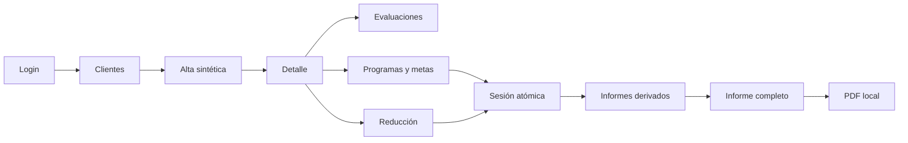

# Revisión comparativa — video, frontend y flujo hasta PDF

Fecha: 2026-08-25  
Fuente observada: `https://www.youtube.com/watch?v=MlN1hqR8rBg&t=4s`  
Frontend auditado: `apps/web/src`  
Datos: sólo fixtures sintéticos; no se ejecutó descarga fuera del workspace.

## Método y límites

Se usó el inventario visual existente del video, muestreado entre 00:00 y 16:30, y se contrastó
con rutas, componentes, repositorios, pruebas y specs actuales. Las observaciones del video se
mantienen como `observed`; una implementación equivalente no convierte una transición no mostrada
en evidencia del producto original.

La descarga PDF real no se ejecutó: el navegador escribiría un archivo fuera del workspace. Se
verificó el generador, el botón, la carga diferida de jsPDF y la ausencia del JPG en la interfaz.

## Recorrido actual verificado por código y pruebas

| Paso | Implementación actual | Resultado |
| --- | --- | --- |
| Login → Clientes | rutas privadas y guard de sesión | PASS |
| Clientes → Alta | `/clientes/nuevo`, formulario sintético y validación | PASS |
| Alta → Detalle | creación y navegación con `replace` | PASS |
| Detalle → Evaluación | tres formularios con repositorio de evaluaciones | PASS parcial |
| Detalle → Adquisición | programa, meta y campos de protocolo | PASS parcial |
| Detalle → Reducción | plan, función y estrategias | PASS parcial |
| Detalle → Sesión | metas/planes reales y RPC atómica | PASS parcial |
| Sesión → Informes | consulta de sesiones, mediciones y ensayos | PASS |
| Informes → PDF | `/informes/completo` + jsPDF bajo demanda | PASS de interfaz; descarga real pendiente |

Regresión local: **95/95 pruebas**, TypeScript y ESLint aprobados.

## Paridad con el video

### Cubierto

- Login y acceso protegido.
- Alta con iniciales, ID, idioma, nacimiento y edad calculada.
- Tutores y hermanos repetibles con quitar/agregar.
- Convivencia.
- Ficha con pestañas de evaluación, adquisición, reducción y sesiones.
- Evaluación de preferencias y funcional con fecha, campos principales y aviso de adjunto no
  persistido.
- Programas, metas, procedimiento, ayudas, respuesta correcta, generalización y mantenimiento.
- Conducta objetivo, definición operacional, medición, función y estrategias.
- Registro de sesión con +/- y correcto/incorrecto.
- Gráficos derivados, impresión y botón PDF local.

### Brechas de paridad abiertas

| ID | Severidad | Brecha | Evidencia |
| --- | --- | --- | --- |
| F-01 | P1 | El alta no contiene adaptaciones del hogar, escolarización, adaptaciones escolares ni registros estructurados de diagnósticos, operaciones y medicamentos que se ven en el video. La ficha muestra esas categorías como texto fijo “Sin …”. | E-004–E-006; `client-form.tsx`; `client-detail-page.tsx` |
| F-02 | P1 | La sesión ofrece unidades `duration`, `latency` e `interval`, pero el control sólo incrementa enteros con +/- como frecuencia. La captura no representa la dimensión elegida. | E-018; `client-detail-page.tsx:SessionsPanel` |
| F-03 | P1 | `/informes/evaluacion` es una vista de alcance/placeholder: no consulta ni imprime los registros de evaluaciones creados. El video muestra un informe de evaluación consolidado. | E-012; `reports-page.tsx` |
| F-04 | P1 | El “Informe completo” PDF actual contiene sesiones, series de conducta y porcentajes de metas; no incluye el detalle de programas, criterios, fechas, línea base, generalización y mantenimiento observado en E-020. Es un resumen derivado minimizado, no un clon funcional del informe completo. | E-020; `complete-report-pdf.ts` |
| F-05 | P1 | No existe una transición directa Detalle → informe del mismo cliente. El usuario debe entrar a Informes y seleccionar manualmente un cliente activo. | E-021; `client-detail-page.tsx`, `reports-page.tsx` |
| F-06 | P1 | No hay prueba automatizada que ejecute `downloadCompleteReportPdf` y valide un archivo PDF o sus páginas. Las pruebas actuales sólo verifican que el botón aparece y que no existe JPG. | `reports-page.test.tsx`; descarga restringida por límite de workspace |
| F-07 | P2 | La entrevista no reproduce la matriz editable de fortalezas/debilidades con columnas Madre, Padre y Cliente, ni las acciones de agregar campo/columna. Actualmente son dos textareas. | E-009; `client-detail-page.tsx` |
| F-08 | P2 | La ficha no implementa consentimiento ni gestión de usuarios asignados que se observan en el video. | E-007–E-008; `client-detail-page.tsx` |
| F-09 | P2 | No existe historial detallado ni corrección controlada de sesiones; sólo se muestra el contador de sesiones. | E-017–E-019; `SessionsPanel` |
| F-10 | P2 | Adjuntos se descartan del payload y no se guardan en Storage. La UI lo comunica correctamente, pero el flujo no llega a la parte de documento observada. | E-010–E-011; `FormPreview` |

## Hallazgos de encadenamiento

El encadenamiento técnico mínimo está completo:

Pero el flujo clínico completo del video no está cerrado: E y F/G guardan una representación
parcial; J no incorpora aún el contenido completo de evaluación y programación; y K no tiene una
prueba de archivo real.

## Criterio de salida

**NO-GO para afirmar paridad completa con el video.**  
**GO técnico para continuar desarrollo local del informe derivado y PDF minimizado con datos
sintéticos.**

Antes de entregar a una profesional, resolver como mínimo F-01, F-02, F-03, F-04 y F-06; luego
repetir el flujo autenticado completo y revisar impresión, teclado, móvil, RLS, no-cache y
minimización.

## Siguiente bloque recomendado

Slice 13 — cierre de paridad clínica y exportación:

1. dimensionar controles de sesión para frecuencia, duración, latencia e intervalo;
2. definir el contenido autorizado del informe de evaluación;
3. ampliar el informe completo con programas/metas y evaluaciones sin incluir datos innecesarios;
4. enlazar el informe al cliente actual;
5. añadir una prueba de generación PDF en un directorio de verificación dentro del workspace;
6. actualizar la brújula y sólo después ejecutar QA autenticado de cierre.

